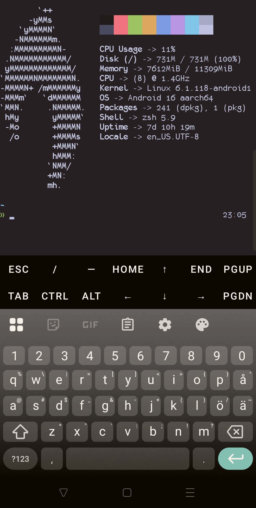

# Termux dotfiles
### 2lach termux dotfiles
[](https://www.codefactor.io/repository/github/2lach/termux-dots/overview/master)
```sh
enviroment: android (arch linux) and termux
shell: zsh, oh my zsh (bash and fish is secondary)

daily use:
vim, vim-plug, ssh, gpg, git, z, starship, golang, nodejs, starship, tldr, nmap and more

```


This is the repo containing my dotfiles, scripts
and various setups and configs is use from my phone.

so if you want to use this setup here is the overview:
First get termux and termux style addon

Then you can just clone this repo to your termux home folder.
The cd into termux-dots/.config/packages
And then run:
`./setup.sh`
this will not mess up your system but it is highly recommended that you read thru the files so you know what your getting into.

The setup script will install quite a few apt packages,node modules, gems, pips and then some.

I use my phone for notetaking (vim) system administration (mostly ssh) some scripting, deployments, testing and so on.
It works for me and might work for you or atleast be a good place to start playing around with termux in a good enviroment with almost all basic setups already taken care of.

For detailed change log view [History file](./History.md)
